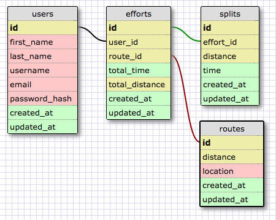

Rundeck
=============

Rundeck is a Rails-based application for keeping track of running times with the ability to enter split times for more granular analysis of running performance. This level of detail in data will allow for running time projections based on past performance.

This is my first post Dev Bootcamp project. It is as much an opportunity to utilize and practice my skills as it is an opportunity to solve a real world problem. Although there are many such websites available online, very few of them offer the ability to track split times without the use of a GPS watch.

As a runner, I would like to be able to keep track of my split times and use the power of the computer to analyse the data without having to purchase an expensive GPS watch.

Schema
=============

